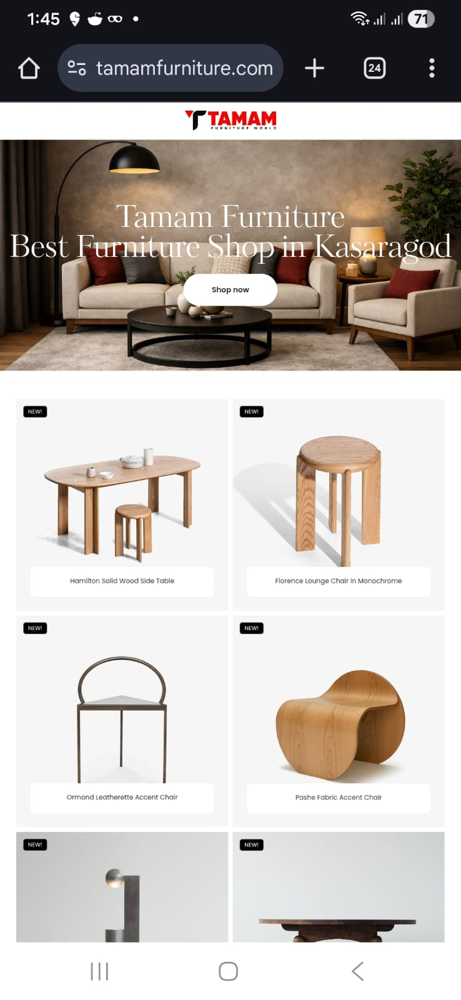
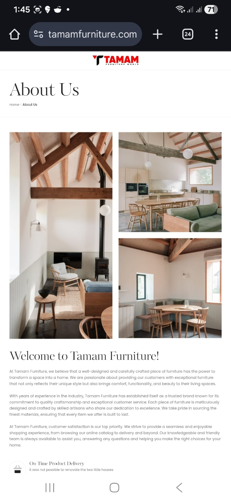

# WordPress Business Website Projects

This repository showcases real-world WordPress business websites built for clients.

## Project Overview
- Custom WordPress theme customization
- Business-focused UI/UX design
- Performance optimization and mobile responsiveness
- Plugin configuration and security hardening
- SEO-friendly structure

## Live Demo
🔗 https://your-client-site.com  
*(Client-owned site; code not publicly shared)*

## Screenshots

### Homepage

### About Page

## My Role
- Theme customization (CSS / layout / components)
- Plugin setup (SEO, cache, security)
- Page builder optimization
- Deployment and production setup

## Tech Stack
- WordPress
- PHP
- HTML / CSS
- JavaScript
- Elementor / Gutenberg (mention what you used)
